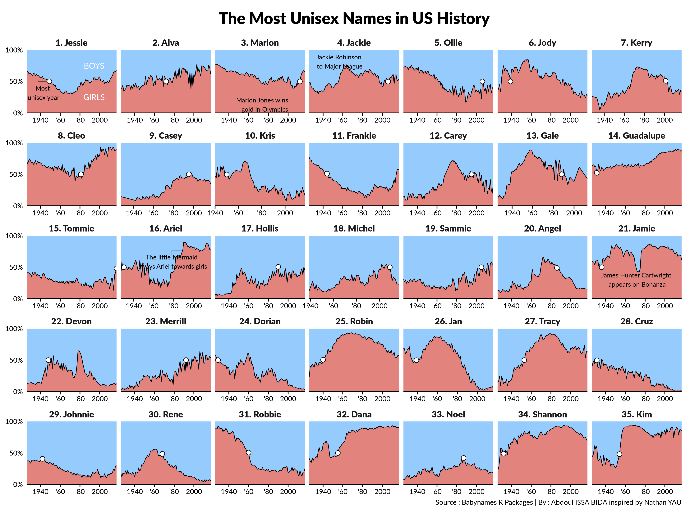

## Most Unisex Names in United States History 

This visualization is an attempt to recreate a visualisation from a [Nathan YAU](https://flowingdata.com/2013/09/25/the-most-unisex-names-in-us-history/) blog post.  
The data comes from [babynames](https://github.com/hadley/babynames)  R package which contains three datasets provided by the USA social security administration.  
The two colors `#E3837D`  and `#96CBFE` from the areas come from Sharla Gelfand R package [ggcute](https://github.com/sharlagelfand/ggcute). 

